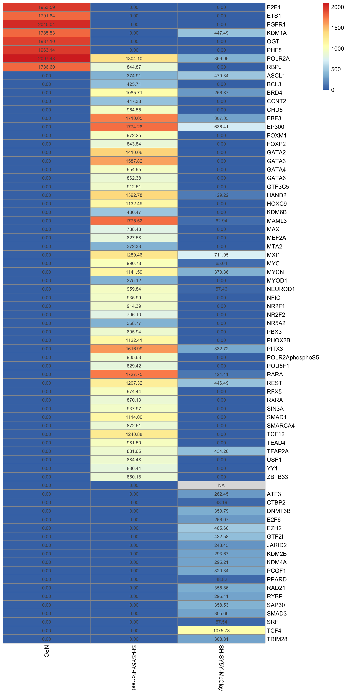
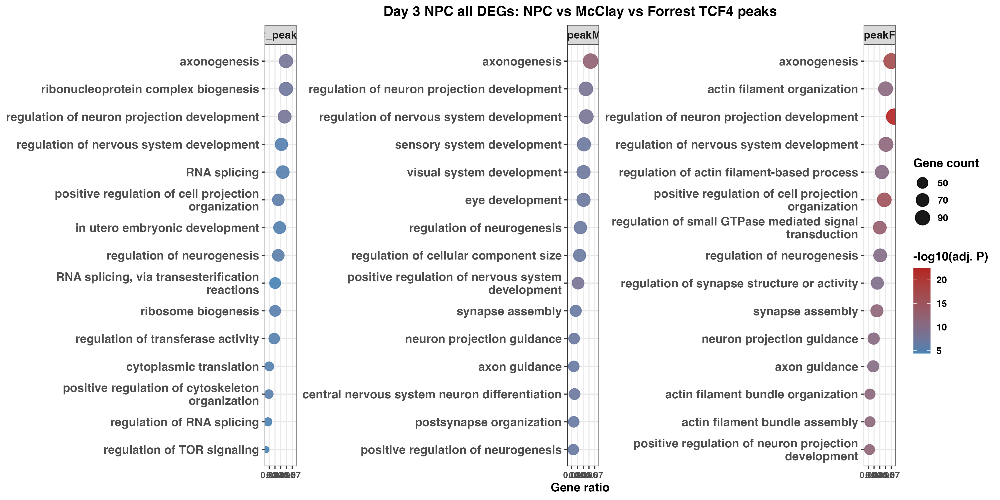

# TCF4 Regulatory Genomics Integration Pipeline

An ongoing computational genomics project integrating **TCF4 ChIP-seq**, transcriptional perturbation, epigenomic annotations, motif analysis, and disease-genetics evidence to characterize TCF4-regulated programs in neural cells.

> **Project status:** Active research. Results are preliminary and should not be interpreted as final biological or clinical conclusions.

## Project overview

Transcription factor 4 (TCF4) is implicated in neurodevelopment and psychiatric disease. This repository organizes the analysis code used to compare TCF4 binding across neural-cell datasets and connect those binding profiles with gene expression, regulatory annotations, pathways, and disease-associated evidence.

The repository is intentionally code-first. Large sequencing files, controlled or third-party datasets, intermediate peak-calling products, and local software environments are not versioned. See [`data/README.md`](data/README.md) for the expected inputs and [`docs/DATA_SOURCES.md`](docs/DATA_SOURCES.md) for source information.

## Analysis pipeline

```text
Public and collaborator-provided datasets
                  |
                  v
    Peak calling and replicate QC
       (MACS2/MACS3 and IDR)
                  |
                  v
 Genome-build harmonization and consensus peaks
                  |
                  v
  Peak annotation and E-box/motif analysis
                  |
                  v
 Integration with epigenomic regulatory features
                  |
                  v
 TCF4 perturbation and transcriptomic integration
                  |
                  v
 Psychiatric/neurodevelopmental genetics enrichment
                  |
                  v
       Statistical testing and reporting
```

Detailed methods and script-to-stage mappings are in [`docs/PIPELINE.md`](docs/PIPELINE.md).

## Repository structure

```text
.
├── app/                       # Exploratory Shiny enrichment application
├── config/                    # Example paths and analysis settings
├── data/                      # Documentation only; research data are excluded
├── docs/                      # Pipeline, data-source, and reproducibility notes
├── reports/                   # Current project summary
├── results/figures/           # Selected lightweight example outputs
└── scripts/
    ├── 01_peaks/              # Peak construction, annotation, motifs, epigenomics
    ├── 02_expression/         # TCF4 perturbation and expression analyses
    ├── 03_disease_integration/# Disease-genetics and transcriptomic integration
    └── 04_reporting/          # Summary visualizations
```

## Getting started

1. Clone the repository and open it as the working directory in RStudio.
2. Copy `config/example_config.yml` to `config/config.yml` and update the data paths.
3. Install the R and command-line dependencies described in [`docs/REPRODUCIBILITY.md`](docs/REPRODUCIBILITY.md).
4. Place locally obtained inputs under `data/raw/` (or set `TCF4_DATA_DIR` to an external data directory).
5. Run the relevant numbered scripts for the analysis stage of interest.

The scripts reflect an evolving research analysis rather than a push-button production workflow. Individual scripts document distinct datasets and hypotheses; some require inputs governed by their original access or licensing terms.

## Representative outputs

### Cistrome similarity across TCF4 peak sets



### Pathway enrichment example



## Research use and privacy

This is a private repository for an ongoing study. It does not contain participant-level data, credentials, local environments, large raw data, or downloaded literature. Before sharing or publishing any output, confirm that the underlying datasets permit redistribution and that all findings have been reviewed.

## Author

**Sina Mohammadian**
PhD researcher in Pharmaceutical Sciences, with research interests in pharmacogenetics, epigenetics, translational research, and molecular biology.

## Citation

This work is ongoing and does not yet have a formal project citation. Dataset-specific publications and accession numbers should be cited when analyses derived from those sources are used; see [`docs/DATA_SOURCES.md`](docs/DATA_SOURCES.md).
